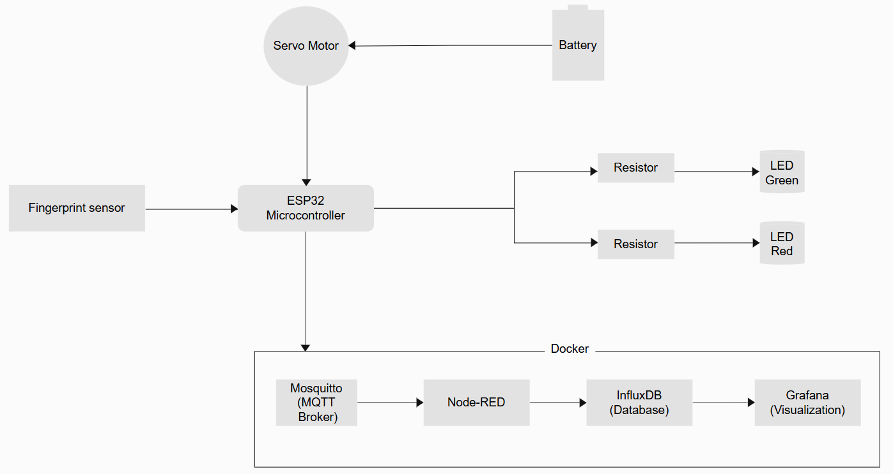
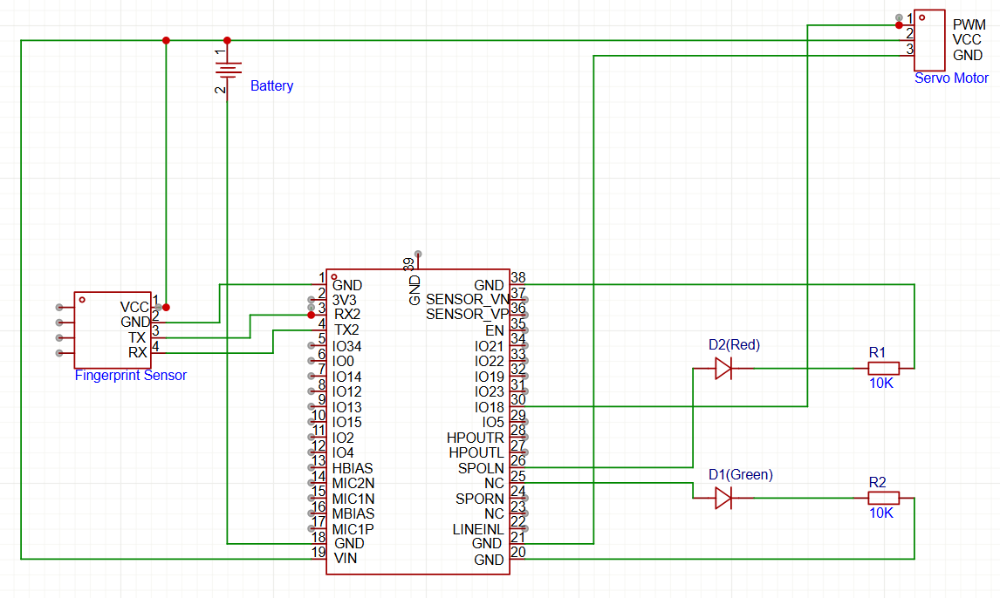

# Fingerprint-based Smart Door Lock System

Access control is one of the important aspects of cybersecurity. This is a prototype of a smart door lock system which provides access control to the resources in an organization. The system is based on fingerprint input. When an authorized user places finger on the sensor, the servo rotates to a right angle simulating the door unlocking.

**Technologies Used**
- ESP32 Microcontroller
- R307S Fingerprint sensor
- Servo motor
- MQTT
- Node-RED
- InfluxDB and Grafana

**Working Mechanism**
When a fingerprint is authenticated, the servo motor rotates to a right angle and green LED is turned on. When the fingerprint is unauthenticated, the servo motor remains stationary, and the red LED is turned on. The system is integrated with Node-RED for visual programming, InfluxDB for database of logs and Grafana for visualization. The IoT to cloud communication was done through MQTT protocol. This system was a low-cost and secure prototype for smart door lock system for access control.

**Schematics**

Fingerprint sensor connections:
| Fingerprint sensor | ESP32 |
|---|---|
| RX | TX |
| TX | RX |
| VCC | VIN |
| GND | GND |

Servo motor connections:
| Fingerprint sensor | ESP32 |
|---|---|
| Signal | GPIO 18 |
| VCC | External power |
| GND | GND |

